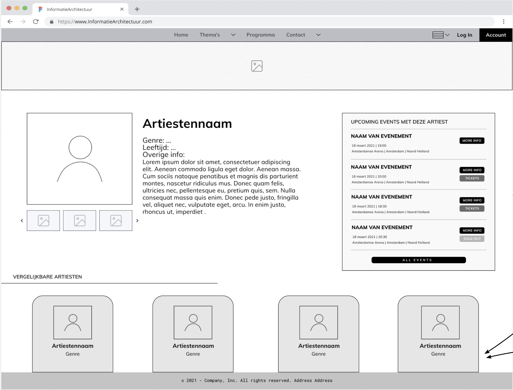
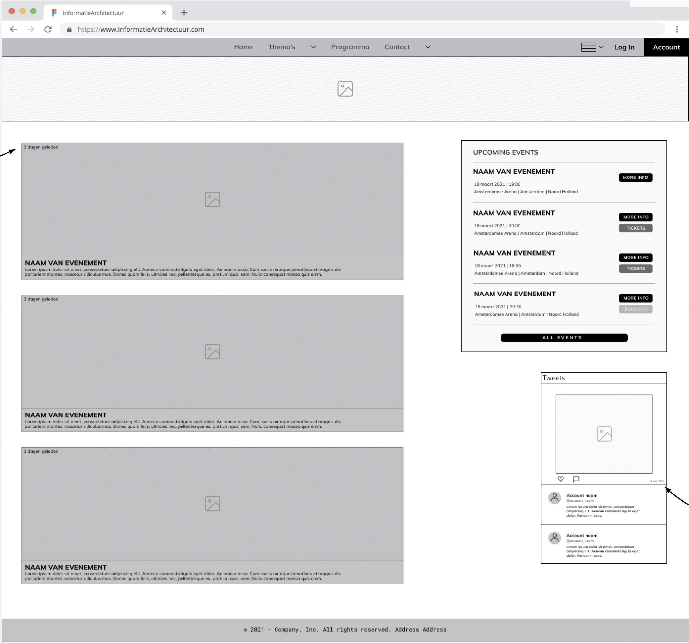
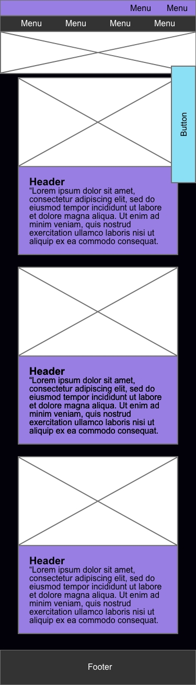
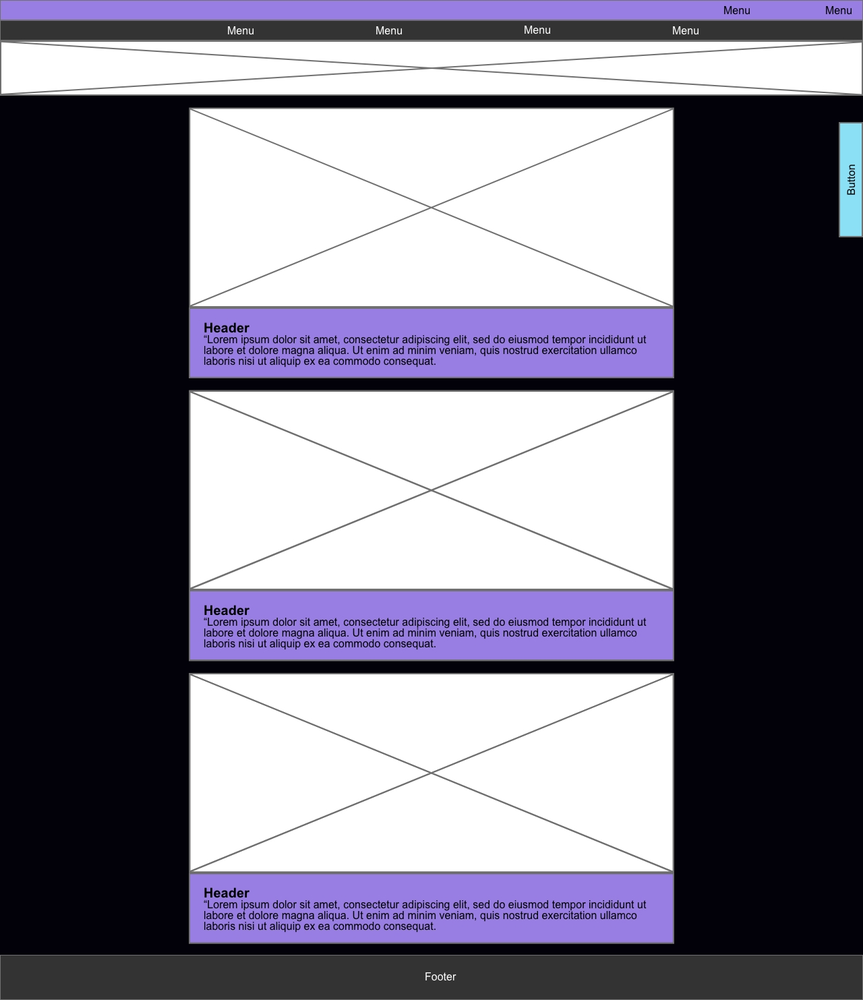
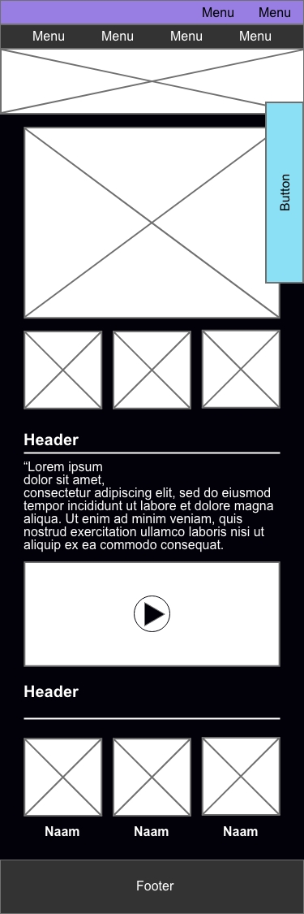
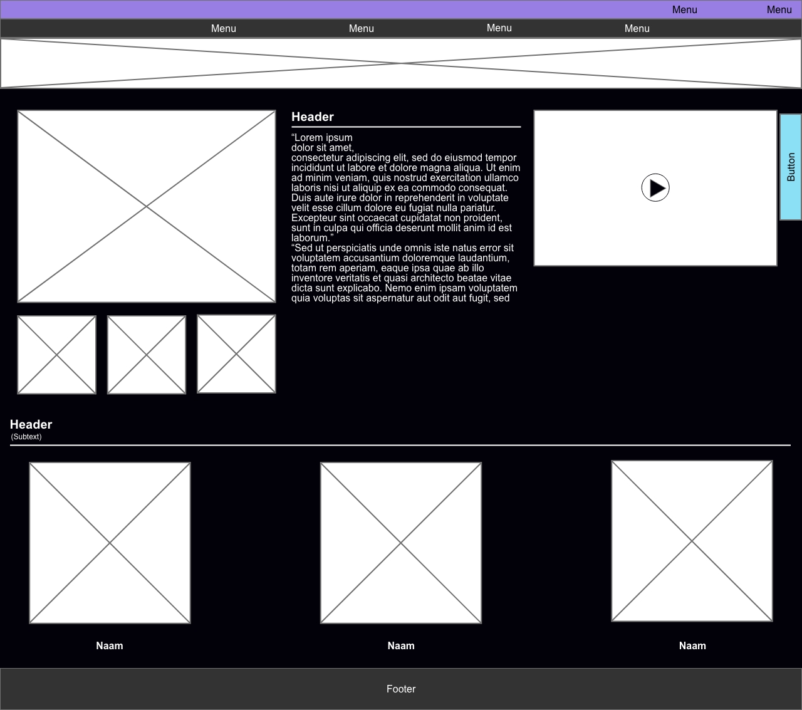
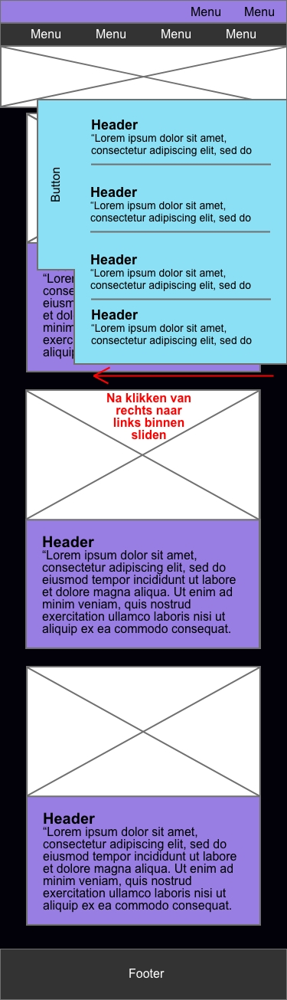
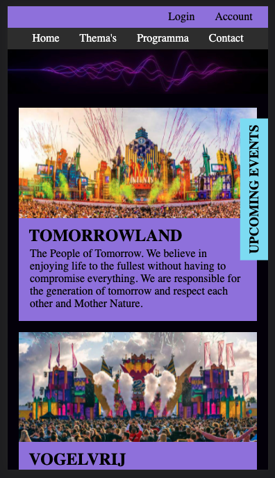
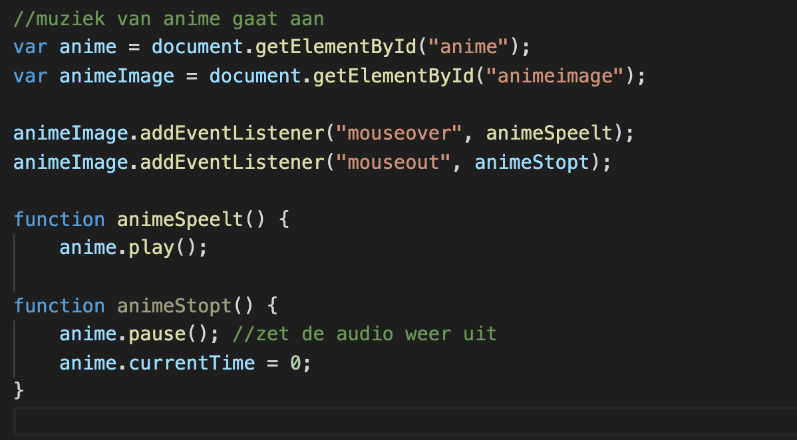
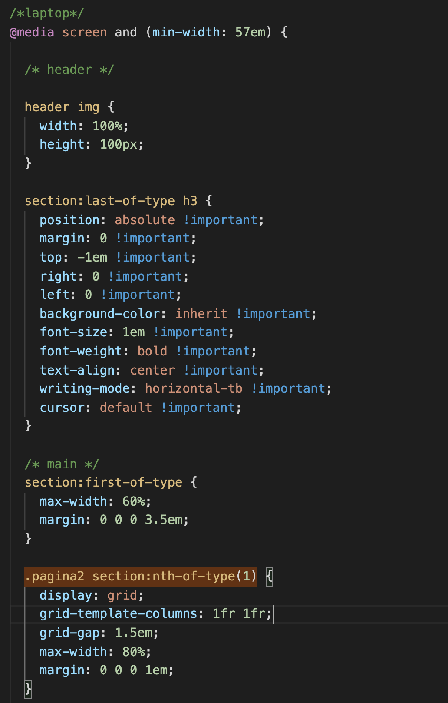

# Procesverslag
Markdown is een simpele manier om HTML te schrijven.  
Markdown cheat cheet: [Hulp bij het schrijven van Markdown](https://github.com/adam-p/markdown-here/wiki/Markdown-Cheatsheet).

Nb. De standaardstructuur en de spartaanse opmaak van de README.md zijn helemaal prima. Het gaat om de inhoud van je procesverslag. Besteedt de tijd voor pracht en praal aan je website.

Nb. Door *open* toe te voegen aan een *details* element kun je deze standaard open zetten. Fijn om dat steeds voor de relevante stuk(ken) te doen.

## Jij

### Auteur:
Joy van Oostveen

#### Je startniveau:
blauw

#### Je focus:
responsive
 

## Je website

### Je opdracht:
https://miro.com/app/board/o9J_lV5uIY8=/

#### Screenshot(s) van de eerste pagina (small screen): 
artiestenpagina
 

#### Screenshot(s) van de tweede pagina (small screen):
Homepagina  
 

 

## Breakdownschets (week 1)

uitwerken na afloop 2e werkgroep

### de hele pagina 1: 

### de hele pagina 2:

### dynamisch deel upcoming events: 
Versie op mobiel (pagina 1)

versie op web (pagina 1)

### Nog een dynamisch deel vergelijkbare artiesten: 

## Voortgang 1 (week 2)

### Stand van zaken
Ik had eigenlijk veel te laat pas door dat we al begonnen moesten zijn met de website coderen, dus liep ik hier vrij ver mee achter. Uiteindelijk toch nog snel een heel stuk html in elkaar kunnen zetten met een mini beetje styling in de CSS. Op die manier had ik wel al een opzetje, maar daar hield het ook wel bij op. Doordat ik mijn site van IA ongeveer na ga maken heb ik ook nog geen mobiele voorbeeldversie, dus die moet ik zelf bedenken door middel van de breakdown schetsen.(heb geen screenshots van de site hoe het er op dit moment uit zag).

### Verslag van meeting
hier na afloop snel de uitkomsten van de meeting vastleggen

- er mist nog een nav bij mijn menu
- probeer meer comments te plaatsen, het zijn er nu te weinig.
- zorg dat je voor volgende les een stuk verder bent!

## Voortgang 2 (week 3)

### Stand van zaken
hier dit ging goed & dit was lastig (neem ook screenshots op van delen van je website en code)

### Verslag van meeting
hier na afloop snel de uitkomsten van de meeting vastleggen

- sections met daarin articles maken.
- font kiezen.
- uren maken!
- responsive maken.

## Toegankelijkheidstest (week 4)

### Bevindingen
Lijst met je bevindingen die in de test naar voren kwamen:
1. Weinig buttons op de site.
2. Alles kan voorgelezen worden door een screenreader.
3. De states zijn nog niet allemaal netjes uitgewerkt.

#### Titel eerste bevinding
Hier korte omschrijving (met indien nodig een afbeelding)

Hier een omschrijving van hoe het opgelost kan worden (met indien nodig een afbeelding)

#### Titel tweede bevinding. 
Hier korte omschrijving (met indien nodig een afbeelding)

Hier een omschrijving van hoe het opgelost kan worden (met indien nodig een afbeelding)

#### Titel volgende bevinding. 
Hier korte omschrijving (met indien nodig een afbeelding)

Hier een omschrijving van hoe het opgelost kan worden (met indien nodig een afbeelding)

#### Titel nog een bevinding. 
Hier korte omschrijving (met indien nodig een afbeelding)

Hier een omschrijving van hoe het opgelost kan worden (met indien nodig een afbeelding)

## Voortgang 3 (week 4)

### Stand van zaken
Mijn html is erg netjes, behalve dat er meerdere Id's gebruikt worden en dat mag niet. 
De css ziet er goed uit, maar wel voor zorgen dat er meer comments komen en ook nog wat meer geordend. Overigens gebruik ik !important, maar dat is geen nette manier van code, dus dat moet nog specifieker aangeroepen worden. 

### Verslag van meeting
hier na afloop snel de uitkomsten van de meeting vastleggen

1. Id's weghalen, die mogen niet.
2. !important is geen nette vormgevingscode, dus oplossen door specifiek aan te spreken.
3. Css netjes ordenen, mag zoals voor mij overzichtelijk is, maar wel net.
4. Responsive maken, voor nu nog niet volledig genoeg, dus goed mee aan de slag.
5. De fout van audio (mouseover, mouseout)) is niet echt op te lossen zonder javascript in html te zetten, wat geen nette code is, dus het is voor nu niet erg.

## Eindgesprek (week 5)

uitwerken voor eindgesprek

### Stand van zaken
hier dit ging goed & dit was lastig (neem ook screenshots op van delen van je website en code)

### Screenshot(s)

hier screenshot(s) van je eindresultaat

## Bronnenlijst

continu bijhouden terwijl je werkt

Nb. Wees specifiek ('css-tricks' als bron is bijv. niet specifiek genoeg).

1. https://codepen.io/joyvanoostveen/pen/abwKbvB
2. https://css-tricks.com/snippets/css/complete-guide-grid/
3. https://www.w3schools.com/css/css_border.asp
4. https://www.w3schools.com/howto/howto_css_style_hr.asp
5. https://www.w3schools.com/css/css_positioning.asp
6. https://www.w3schools.com/css/css3_shadows_box.asp
7. https://www.w3schools.com/cssref/css_selectors.asp
8. https://partyflock.nl/artist/44260/biography