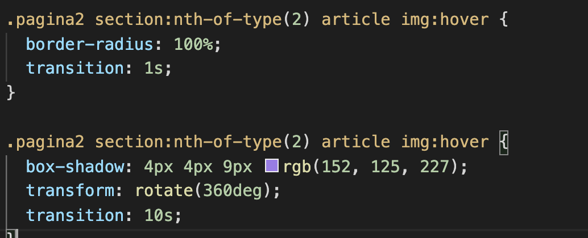
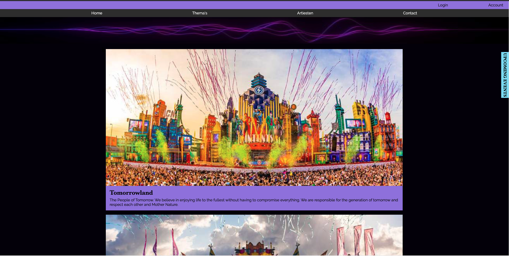

# Procesverslag
Markdown is een simpele manier om HTML te schrijven.  
Markdown cheat cheet: [Hulp bij het schrijven van Markdown](https://github.com/adam-p/markdown-here/wiki/Markdown-Cheatsheet).

Nb. De standaardstructuur en de spartaanse opmaak van de README.md zijn helemaal prima. Het gaat om de inhoud van je procesverslag. Besteedt de tijd voor pracht en praal aan je website.

Nb. Door *open* toe te voegen aan een *details* element kun je deze standaard open zetten. Fijn om dat steeds voor de relevante stuk(ken) te doen.

## Jij

### Auteur:
Joy van Oostveen

#### Je startniveau:
blauw

#### Je focus:
responsive
 

## Je website

### Je opdracht:
https://miro.com/app/board/o9J_lV5uIY8=/

#### Screenshot(s) van de eerste pagina (small screen): 
Homepagina  

 

#### Screenshot(s) van de tweede pagina (small screen):

artiestenpagina

 
 

## Breakdownschets (week 1)

uitwerken na afloop 2e werkgroep

### de hele pagina 1: 

### de hele pagina 2:

### dynamisch deel upcoming events: 
Versie op mobiel (pagina 1)

versie op web (pagina 1)

### Nog een dynamisch deel vergelijkbare artiesten: 

## Voortgang 1 (week 2)

### Stand van zaken
Ik had eigenlijk veel te laat pas door dat we al begonnen moesten zijn met de website coderen, dus liep ik hier vrij ver mee achter. Uiteindelijk toch nog snel een heel stuk html in elkaar kunnen zetten met een mini beetje styling in de CSS. Op die manier had ik wel al een opzetje, maar daar hield het ook wel bij op. Doordat ik mijn site van IA ongeveer na ga maken heb ik ook nog geen mobiele voorbeeldversie, dus die moet ik zelf bedenken door middel van de breakdown schetsen.(heb geen screenshots van de site hoe het er op dit moment uit zag).

### Verslag van meeting
hier na afloop snel de uitkomsten van de meeting vastleggen

- er mist nog een nav bij mijn menu
- probeer meer comments te plaatsen, het zijn er nu te weinig.
- zorg dat je voor volgende les een stuk verder bent!

## Voortgang 2 (week 3)

### Stand van zaken
Alles passend maken voor mobiel formaat is gelukt, behalve het binnen laten sliden van upcoming events. Ook heb ik al een start gemaakt met mijn 2e pagina, omdat ik bang was dat ik het anders niet zou redden voor de uiteindelijke deadline, plus het is makkelijk werken als je de 2e pagina al hebt met dingen die hetzelfde zijn. Inmiddels heb ik ook al een soort huisstijl gemaakt, wat je op beide pagina's terug ziet.

### Pagina 1

### Pagina 2

### Verslag van meeting
hier na afloop snel de uitkomsten van de meeting vastleggen

- sections met daarin articles maken, is nettere html code.
- font(s) kiezen, nu is het nog de standaard.
- uren maken!
- responsive maken.
- javascript toevoegen, onder andere voor de upcoming events button.

## Toegankelijkheidstest (week 4)

### Bevindingen
Lijst met je bevindingen die in de test naar voren kwamen:
1. Weinig buttons op de site.
2. Alles kan voorgelezen worden door een screenreader.
3. De states zijn nog niet allemaal netjes uitgewerkt.

#### Weinig focusbare elementen
Eigenlijk zijn op dit moment alleen de menu onderdelen focusbaar. Dit komt omdat die wel een link hebben en de rest werkt niet op die manier. Toch zou je wel moeten kunnen focussen op andere onderdelen als je nog meer pagina's zou hebben om heen te gaan.

Door "tabindex" toe te voegen is het mogelijk om toch te kunnen focussen op onderdelen die geen link of button zijn. Vervolgens kan je zoals je op de 2e afbeelding ziet een :focus toevoegen en zelf stylen.

#### Focusbare elementen zijn nog standaard 
Er is nog helemaal geen :focus styling toegepast op beide pagina's, waardoor de focus nu nog standaard is en niet perse passend bij de site. Afbeelding hieronder laat standaard focus zien.

Door de focusbare elementen in css een :focus te geven kan je ze zelf stylen. Vervolgens kan je naar eigen wens vormgeven, zodat het beter past bij de rest van de site. Afbeelding hieronder laat de nieuwe eigen focus zien.

#### States naast focus zijn nog niet ver genoeg uitgewerkt
Er zijn wel een paar dingen die hoverbaar zijn, maar verder is er weinig interactie op de pagina's nog. Ook is er nog geen een active state te vinden.

In css is :active, :hover, :focus en @keyframes toegevoegd. Hiermee kan je ze allemaal stylen naar eigen keuze. De keyframes zijn niet perse nodig, maar heb ik zelf voor gekozen om het leuker te maken.

## Voortgang 3 (week 4)

### Stand van zaken
Mijn html is erg netjes, behalve dat er meerdere Id's gebruikt worden en dat mag niet. 

De css ziet er goed uit, maar wel voor zorgen dat er meer comments komen en ook nog wat meer geordend. Overigens gebruik ik !important, maar dat is geen nette manier van code, dus dat moet nog specifieker aangeroepen worden. 

### Verslag van meeting
hier na afloop snel de uitkomsten van de meeting vastleggen

- Id's weghalen, die mogen niet.
- !important is geen nette vormgevingscode, dus oplossen door specifiek aan te spreken.
- Css netjes ordenen, mag zoals voor mij overzichtelijk is, maar wel net.
- Responsive maken, voor nu nog niet volledig genoeg, dus goed mee aan de slag.
- De fout van audio (mouseover, mouseout)) is niet echt op te lossen zonder javascript in html te zetten, wat geen nette code is, dus het is voor nu niet erg.

## Eindgesprek (week 5)

uitwerken voor eindgesprek

### Stand van zaken
Ik wilde heel graag werken met animaties, maar dit snapte ik een hele tijd niet zo goed. Uiteindelijk snap ik het nu wel en heb ik daar wat mee in elkaar kunnen zetten. 

Poging 1 tot meerdere acties op hover (niet goed nog):

poging 2 door middel van keyframes (werkt wel):

Ook wilde ik de mogelijkheid dat er extra tekst in beeld komt vanaf een bepaald formaat, maar vooraf daaraan moet het er ook zijn alleen dan scrollbaar en bij telefoon moet het weg zijn. Hier heb ik heel erg mee lopen puzzelen, maar dat is ook mogelijk geworden.

Probleem toen het nog niet werkte:

Verder was het steeds goed opletten dat ik zo specifiek mogelijk alles aansprak in mijn css. Op die manier kon ik beter het overschrijven voorkomen van dingen die niet overschreven mochten worden. 
Ik heb steeds gewerkt met nth-child(), maar het werkte steeds niet en ik snapte niet waarom. Tot ik erachter kwam dat nth-of-type(), de oplossing was en spontaan ging alles 100x zo makkelijk met aanspreken. Hierdoor heb ik vrijwel geen gebruik van classes hoeven maken. Er staat een class op de body van pagina 2, om zo dingen van pagina 2 specifieker aan te kunnen spreken voor die pagina. 
Bij de animatie van de vergelijkbare artiesten heb ik ook met javascript audio toegevoegd. Nu is dit met mouseover, alleen wordt dat niet meer volledig ondersteund door Chrome, doordat ze niet willen dat je zonder ook maar te klikken opeens geluid hebt. Dit valt niet op te lossen met semantische code en daardoor heb ik besloten dat het zo blijft staan als het nu is. Onder vergelijkbare artiesten staat de tekst (klik random om audio te activeren), op die manier word je hier van te voren over ingelicht. Zo is het toch mogelijk om mouseover te houden, want het is wel toegestaan als er eerst al op de pagina ergens geklikt is.

### Screenshot(s)

### Pagina 1

### Pagina 2

### Extra's

## Bronnenlijst

continu bijhouden terwijl je werkt

1. https://codepen.io/joyvanoostveen/pen/abwKbvB
2. https://css-tricks.com/snippets/css/complete-guide-grid/
3. https://www.w3schools.com/css/css_border.asp
4. https://www.w3schools.com/howto/howto_css_style_hr.asp
5. https://www.w3schools.com/css/css_positioning.asp
6. https://www.w3schools.com/css/css3_shadows_box.asp
7. https://www.w3schools.com/cssref/css_selectors.asp
8. https://partyflock.nl/artist/44260/biography
9. https://codepen.io/shooft/pen/zYzdMwO 
10. https://codepen.io/shooft/pen/gOrJdGG
11. https://320ytmp3.com/nl3/download?type=ytconv&url=https%3A%2F%2Fwww.youtube.com%2Fwatch%3Fv%3DmHeHqKgJlGM
12. https://fonts.adobe.com/
13. https://codepen.io/shooft/pen/mdwroZE
14. https://oege.ie.hva.nl/~oostvej/Eindopdracht%20Internetstandaarden/home.html
15. https://validator.w3.org/nu/
16. https://jigsaw.w3.org/css-validator/